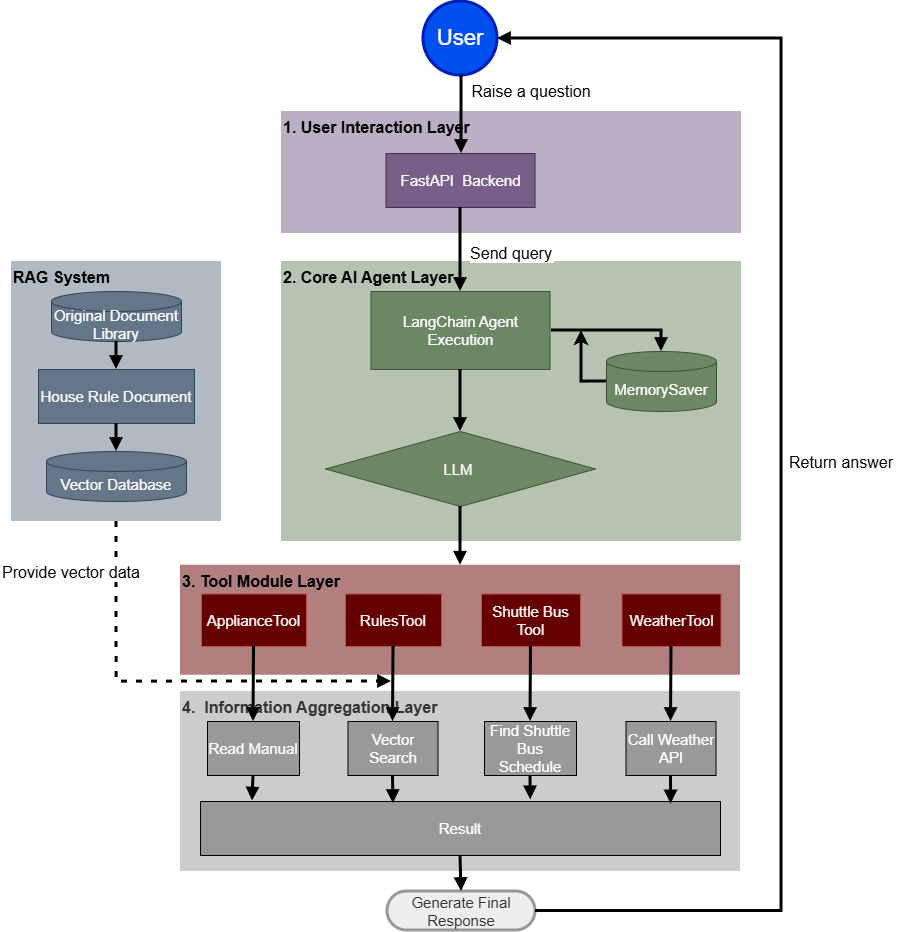
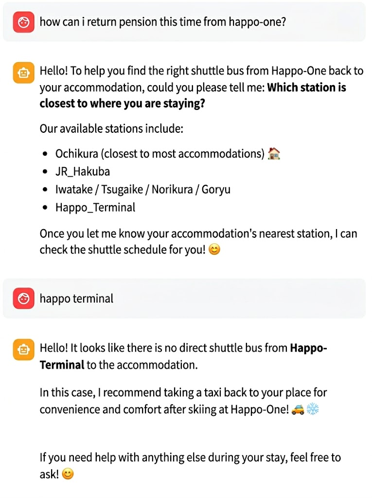

Markdown
# LangChainを用いた宿泊施設向けAIエージェント


## サマリー

### プロジェクト概要
- 本プロジェクトは、長野県白馬村のスキー民宿を想定し、多言語対応・時間認識機能を備えたAIコンシェルジュを提供する、実践的なAgentic RAG（エージェントベースの検索拡張生成）システムです。

### 開発の背景
- 本プロジェクトは、私の妻が白馬村の民宿でアシスタントとして働いていた際の実際の課題から生まれました。ゲストがチェックインする度に、民宿の注意事項や村内のバスの運行状況をゼロから説明する必要があり、多大な時間を費やしていました。この負担の大きいルーティンワークをAIで効率化・自動化できないかというアイデアから出発し、現場での主要な課題を解決するためのデモとして本システムを開発しました。

### Agent構造図


### デモ画面 (Demo)
以下はシステムの実際の動作とエージェントの応答プロセスのデモです：


[English](#english) | [日本語](#日本語)

---

## English

###  Project Overview
This project is an educational, learning-focused Agentic RAG (Retrieval-Augmented Generation) system built around the concept of a ski guesthouse in Hakuba, Japan. Designed as a practical exploration into modern AI architectures, it moves beyond traditional single-pass RAG pipelines. The project integrates high-efficiency local LLM deployment (utilizing Qwen3.5:9b), intelligent tool-routing, and multimodal frontend rendering to simulate a highly localized, multilingual, and time-aware intelligent steward service.

### Core Features
*  **Supervisor Multi-Agent Routing**: A central routing agent autonomously delegates tasks to specialized sub-agents (Appliance Expert, Local Guide, Rule Enforcer) based on guest queries.
*  **Strict Multilingual Protocol**: Automatically detects the guest's language (English, Japanese, Chinese) and forces the LLM to reply purely in that language via prompt injection.
*  **Time-Aware Structured Data**: Parses complex static bus timetables into JSON and injects the real-time system clock, accurately answering queries like "When is the next bus?"
*  **Real-Time Weather Scraper**: An error-resilient BeautifulSoup/Pandas web scraper that extracts live weather and snow conditions directly from Hakuba Valley's official websites.
*  **Dynamic UI Rendering**: A custom Regex string-replacer intercepts backend tags (e.g., `[IMAGE:xxx]`) and renders them instantly as beautiful UI interactive buttons in Streamlit.

### Getting Started
1. Prerequisites

    Ensure you have Python 3.10+ installed. Install the required dependencies:
    ```Bash
    pip install -r requirements.txt
    ```
    Pull the required local LLM and embedding models via Ollama:
    ```Bash
    ollama pull qwen3.5:9b-q4_K_M
    ollama pull bge-m3
    ```

2. Start the Backend (Agent Engine)

    Open your first terminal and run the FastAPI server:

    ```Bash
    python -m uvicorn backend.main:app --reload
    ```
3. Start the Frontend (User Interface)

    Open a second terminal and run the Streamlit app:

    ```Bash
    streamlit run frontend/app.py
    ```


## 日本語

### プロジェクト概要
本プロジェクトは、日本の白馬村にあるスキー民宿をテーマにした、学習・実践目的の Agentic RAG（エージェントベースの検索拡張生成） システムです。最新のAIアーキテクチャを学ぶための個人プロジェクトとして開発されており、従来の単方向のRAGパイプラインとは異なり、高効率なローカルLLM (Qwen3.5:9b) のデプロイ、インテリジェントなツールルーティング制御、およびマルチモーダルなフロントエンド描画技術の融合を試みています。地域に密着した、多言語対応かつ時間認識機能を備えたスマートコンシェルジュのシミュレーションを目指しています。

### 主な機能
* **スーパーバイザーによるマルチエージェントルーティング**: 中央のルーティングエージェントが、ゲストの質問に基づいて専門のサブエージェント（家電エキスパート、ローカルガイド、ルール管理者）に自律的にタスクを割り当てます。
* **厳格な多言語プロトコル**: ゲストの言語（英語、日本語、中国語）を自動検出し、プロンプトインジェクションを通じて LLM に必ずその言語で返信するように強制します。
* **時間認識型の構造化データ**: 複雑で静的なバスの時刻表を JSON に解析し、システムのリアルタイム時刻を注入することで、「次のバスは何時ですか？」といった質問に正確に回答します。
* **リアルタイム天気スクレイパー**: 障害に強い BeautifulSoup / Pandas ウェブスクレイパーを使用し、白馬バレーの公式サイトから最新の天気と雪の状況を直接抽出します。
* **動的 UI レンダリング**: 独自の正規表現文字列置換機能により、バックエンドのタグ（例: `[IMAGE:xxx]`）をインターセプトし、Streamlit 上で美しい UI インタラクティブボタンとして瞬時に描画します。

### はじめに
1. 前提条件
    
    Python 3.10 以上がインストールされていることを確認してください。必要な依存パッケージをインストールします：

    ```Bash
    pip install -r requirements.txt
    ```

    Ollama を使用して、必要なローカル LLM とエンベディングモデルをダウンロードします：

    ```Bash
    ollama pull qwen3.5:9b-q4_K_M
    ollama pull bge-m3
    ```

2. バックエンドの起動（AI エンジン）

    1つ目のターミナルを開き、FastAPI サーバーを起動します：

    ```Bash
    python -m uvicorn backend.main:app --reload
    ```

3. フロントエンドの起動（ユーザーインターフェース）

    2つ目のターミナルを開き、Streamlit アプリを起動します：

    ```Bash
    streamlit run frontend/app.py
    ```